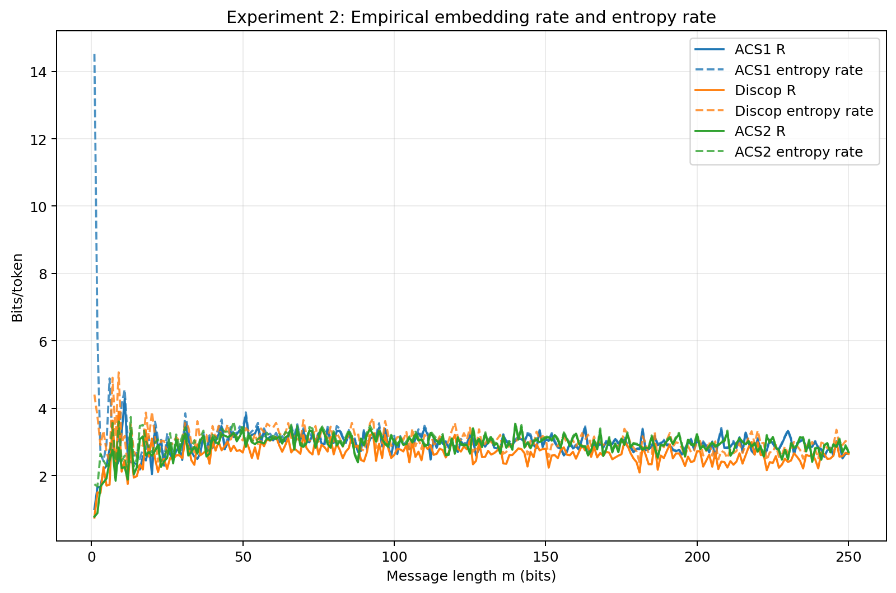
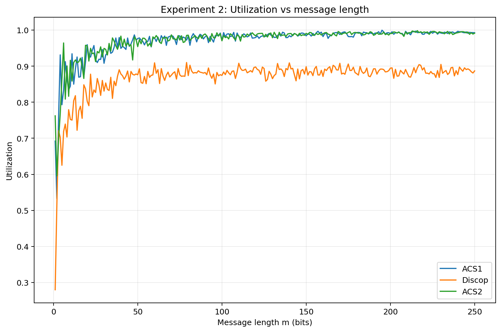
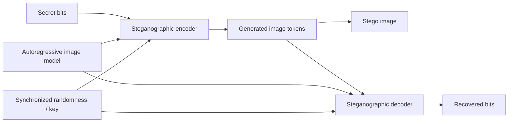

# Autoregressive Image Steganography

Research-oriented implementation and evaluation of **generative image steganography** for autoregressive models. The project compares **Arithmetic Coding for Steganography (ACS)**, **Discop**, and **ACS 2.0** across PixelCNN++, ImageGPT, and Taming Transformer image generators.

> This is steganography rather than post-hoc watermarking: secret bits are embedded during autoregressive sampling and recovered by reconstructing the same model-conditioned token distributions.

## Highlights

- Implemented encode/decode pipelines for autoregressive steganography with synchronized sampling.
- Integrated the methods with **PixelCNN++**, **ImageGPT-small**, and **Taming Transformer**.
- Evaluated on **CIFAR-10**, **CelebA**, and **FFHQ**.
- Measured embedding rate, source-entropy utilization, FID, PSNR, LPIPS, and encode/decode time.
- Preserved completed experiment outputs so results can be inspected without re-running expensive model inference.
- Kept pretrained model weights and raw datasets out of Git.

## Experimental Results

The saved experiments use image completion and compare all three schemes under the same autoregressive source.

| Model / Dataset | Scheme | Rate (bits/token) | Entropy Utilization | FID | LPIPS |
|---|---:|---:|---:|---:|---:|
| PixelCNN++ / CIFAR-10 | ACS | 3.04 | 100.0% | 111.89 | 0.050 |
| PixelCNN++ / CIFAR-10 | Discop | 2.76 | 89.9% | 115.55 | 0.051 |
| PixelCNN++ / CIFAR-10 | ACS 2.0 | 3.02 | 100.0% | 118.39 | 0.045 |
| ImageGPT / CelebA | ACS | 2.78 | 100.0% | 103.91 | 0.103 |
| ImageGPT / CelebA | Discop | 2.40 | 88.8% | 99.86 | 0.101 |
| ImageGPT / CelebA | ACS 2.0 | 2.76 | 100.0% | 100.31 | 0.103 |
| Taming Transformer / FFHQ | ACS | 6.95 | 100.0% | 94.90 | 0.261 |
| Taming Transformer / FFHQ | Discop | 6.66 | 95.3% | 94.29 | 0.264 |
| Taming Transformer / FFHQ | ACS 2.0 | 6.96 | 100.0% | 91.63 | 0.260 |

Small values above 100% in raw utilization logs come from empirical/numerical estimation and are rounded to 100.0% here.

### ImageGPT: Embedding Rate vs. Message Length



### ImageGPT: Entropy Utilization vs. Message Length



## Method Overview

### ACS

ACS treats a secret bit string as a point in an arithmetic-coding interval and generates tokens whose nested probability intervals identify that message.

### Discop

Discop constructs a Huffman tree from the model's next-token distribution. At each internal node, synchronized pseudo-random sampling and a rotated distribution copy determine whether a secret bit can be consumed while selecting the next branch.

### ACS 2.0

ACS 2.0 adds randomized rotation to the arithmetic-sampling process so the generated token distribution can match the autoregressive source distribution while retaining high embedding efficiency.

## System Flow



The receiver must reproduce the same autoregressive conditional distributions and synchronized randomness used by the sender.

## Repository Structure

```text
.
├── ACS1Image/                    # ACS implementation
├── DiscopImage/                  # Discop implementation
├── PixelCNN++/                   # PixelCNN++ model code + upstream license
├── docs/
│   └── EXPERIMENTS.md
├── results/
│   ├── imagegpt_celeba/
│   ├── pixelcnn_cifar10/
│   └── taming_ffhq/
├── acs2_integer.py               # Integer-precision ACS 2.0 encoder/decoder
├── imagegpt_celeba_image.py      # ImageGPT + CelebA experiments
├── pixelcnnpp_cifar10_image.py   # PixelCNN++ + CIFAR-10 experiments
├── taming_ffhq_image.py          # Taming Transformer + FFHQ experiments
├── test_imagegpt_acs2.py         # Lightweight ImageGPT ACS 2.0 demo
├── requirements.txt
└── THIRD_PARTY_NOTICES.md
```

## Quick Start

### 1. Create an environment

Python 3.12 was used for the completed project experiments.

```bash
python -m venv .venv
```

Activate the environment, then install dependencies:

```bash
pip install -r requirements.txt
```

### 2. ImageGPT / CelebA

ImageGPT weights are downloaded through Hugging Face when needed.

```bash
python imagegpt_celeba_image.py
```

### 3. PixelCNN++ / CIFAR-10

Download the pretrained CIFAR-10 PixelCNN++ checkpoint from the upstream implementation and place it at:

```text
PixelCNN++/checkpoints/pixelcnnpp_cifar10.pth
```

Then run:

```bash
python pixelcnnpp_cifar10_image.py
```

### 4. Taming Transformer / FFHQ

Create `taming_ffhq_cache/`, clone Taming Transformers, and place the pretrained FFHQ transformer checkpoint/configuration there:

```text
taming_ffhq_cache/
├── taming-transformers/
├── ffhq_transformer.ckpt
└── ffhq_transformer_project.yaml
```

For current PyTorch versions, the upstream `torch._six` compatibility issue may require replacing its old `string_classes` import with:

```python
string_classes = (str, bytes)
```

Then run:

```bash
python taming_ffhq_image.py
```

More details are in [`docs/EXPERIMENTS.md`](docs/EXPERIMENTS.md).

## Reproducibility Notes

- Experiment seed: `666666`
- ImageGPT model: `openai/imagegpt-small`
- ImageGPT image size: `32 x 32`
- ImageGPT completion context ratio: `0.5`
- Main evaluation: 100 image completions per model/dataset pair
- Message-length sweep: `m = 1...250`, 10 trials per message length
- Raw datasets, downloaded checkpoints, and model caches are intentionally excluded from Git

## Tech Stack

**Python · PyTorch · Hugging Face Transformers · autoregressive generation · information theory · image steganography · NumPy · pandas · Matplotlib · LPIPS · FID**

## Research References and Attribution

This repository builds on published methods and open-source pretrained-model implementations. See [`THIRD_PARTY_NOTICES.md`](THIRD_PARTY_NOTICES.md) for code/model attribution.

Key references:

- Ding et al., **Discop: Provably Secure Steganography in Practice Based on Distribution Copies**, IEEE S&P 2023.
- Ziegler, Deng, and Rush, **Neural Linguistic Steganography**, EMNLP-IJCNLP 2019.
- Salimans et al., **PixelCNN++**, 2017.
- Chen et al., **Generative Pretraining from Pixels (ImageGPT)**, 2020.
- Esser, Rombach, and Ommer, **Taming Transformers for High-Resolution Image Synthesis**, CVPR 2021.

## Notes

The project evaluates **information-hiding capacity and statistical/visual fidelity**, not robustness to post-processing attacks. It should therefore be presented as generative steganography rather than as a robust image-watermarking system.
